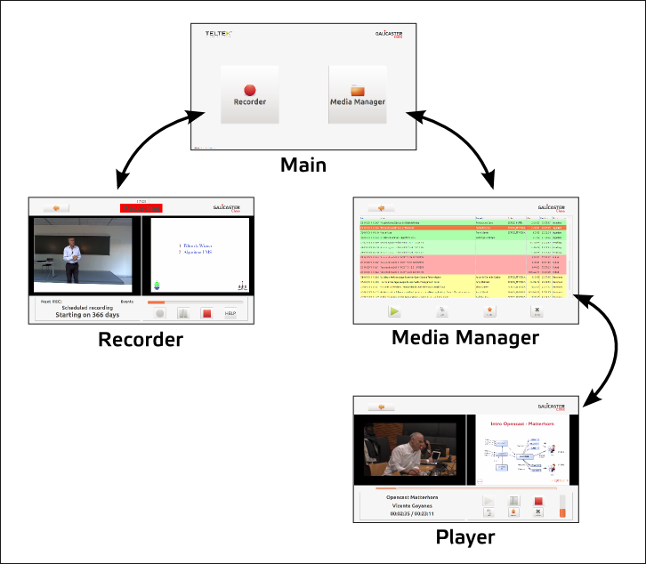

User Guide
==========
This page is updated to the 1.4.2 release

This area will compile all the information available about the daily use of Galicaster. Some of this information is also available in the docs folder of the source code.

Galicaster can be operated on two different ways, depending on the areas available to the user:

* The application can be blocked on the Recorder Area, thus being used only for recording. This is specially useful when the unit is handled by lecturers and the recordings are scheduled, then triggered automatically.
* If the interface is unblocked all areas are accesible - profile selector, media manager. This mode is meant to advanced users and editors, who can edit the metadata, perform operations over the recordings and select the input profile they prefer.

#### Manage recordings
You can do operations like ingesting, editing metadata or deleting a recording in the [Media Manager](UserGuide/MediaManager.md). Just select a recording and use the different buttons available.

#### Play recordings
To play a video you have to enter Media Manager and select a recording. Playable recordings need to be stored in the repository folder. In the player mode, you can also ingest and delete the recording or edit its metadata.

#### Recording
To make a recording you have to access the [Recorder](UserGuide/Recorder.md). Once there, if available, you can start recording whenever you want. Make sure that your laptop is connected and the sound activeted before start it.

