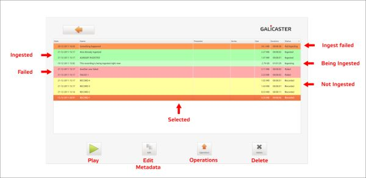
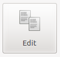
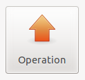
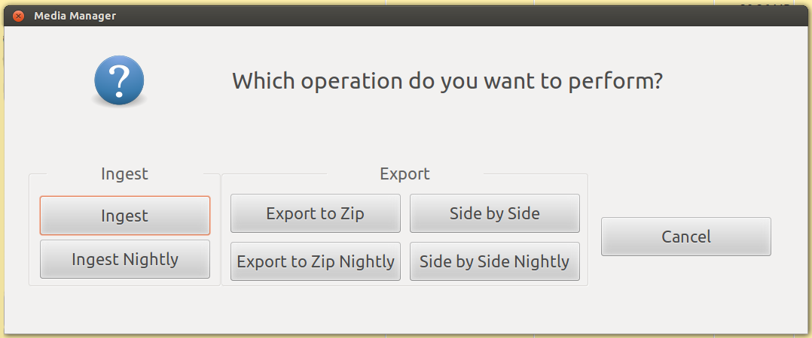
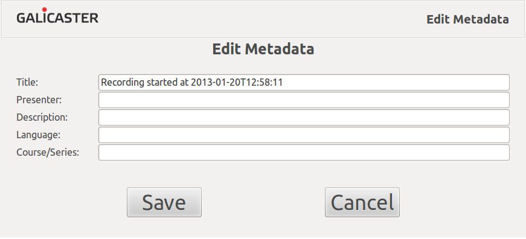

User Guide - Media Manager
==========================

The Media Manager is the area where recordings are browsed. You can do operations on all the finished recordings from here. Two of the most important features are [Metadata](Metadata.md) and [Operations](Operations.md). We will take a brief look to all its features.

### Play

To play a recording, double click on it or select it and press the Play Button. All the operations available in the Media Manager are also available in the Player environment.

### Edit Metadata

Recording metadata can be set up and edited. If the recording has been scheduled, the metadata is already filled up, otherwise it should be edited manually. When a recording is finished it appears on the Media Manager, where it can be browsed and edited. [More information on Metadata Edition](#metadata-edition)

### Delete

Any recording can be deleted but be aware that it will be erased from your hard disk as well.

### Operations

Operations are the different actions that can be applied on recordings. When an operation is triggered it will be enqueued until previous operations are finished, showing Pending as its status. Once started, the operation status will change to Processing. If the operation processing is successful its status will change to Done, otherwise it will Failed.

Operations can be performed nightly, meaning they will be triggered at the period established as 'night', by default local midnight. This way, recording and processing will not interfere with each other. Nightly operations can be cancelled before they start. Selecting an immediate operation on a recording with that operation already scheduled as 'nightly' will override it.

Operations take some time to be performed and they always consume some CPU load, so be careful of triggering operations right before starting a recording.



###### Ingest
Ingest is the operation that sends the recordings to the publishing platform.

Ingestion requires network access and some configuration data indicating parameters of the server to connect. Ingest will not be available if:

* The server configuration is wrong.
* The connection is disabled.
* The network is down.
* The server is down.
* The server is unreachable.

Once ingested, a recording can be re-ingested, but it will probably overwrite the previous one if you do it in the same server.

###### Export to zip
Export to zip will gather all the recording streams and metadata files into a single uncompressed zip file. The zip package will be placed on the zip designated folder, by default the user Home folder (i.e. /home/user/).

###### Side by Side
Side by side operation exports a mediapackage streams to a single file. Once finished the resulting file will be placed on the sidebyside designated folder, by default the user Home folder (e.g. `/home/user/`).

###### Operation Status and Colors
The status of an operation is represented by both its cell colour and the message in the 'Operation' column in this way:

* None : The operation has not been performed or enqueued yet.
* Nightly : The operation will be perfomed on the timetable set as nocturne.
* Pending : The operation is enqueued, waiting for other operations to be finished.
* Processing : The operation is being performed.
* Done : The operation was succesful.
* Failed : The operation has failed for some reason.

Colors can be modified by the administrator. Classic view ~~with lines coloured in function of the ingestion status~~ can also be set up.

Metadata is the information related to the audivisual content on a recording. The metadata and content together forms a Mediapackage. In the Galicaster repository each folder represents a Mediapackage. Metadata is stored permanently on XML files. **These files should not be edited directly**.

The Galicaster metadata scheme is based on the [Matterhorn Metadata Scheme](https://opencast.jira.com/wiki/pages/viewpage.action?pageId=14614561), and it is based on the Dublin Core initiative.

### Metadata edition
Metadata is the information related to the audivisual content in a recording. Mediapackages are simply a bundle containing the metadata and media content together. In the Galicaster repository, every folder represents a Mediapackage.
In a Mediapackage, metadata is stored permanently on XML files. **These files should not be edited manually**.

The Galicaster metadata scheme is based on the [Matterhorn Metadata Scheme](https://opencast.jira.com/wiki/pages/viewpage.action?pageId=14614561), which in turn is based on the Dublin Core initiative.

Metadata can be edited at different stages of the recording and the Mediapackage life cycle:

1. In scheduled recordings, at the Schedule UI in Opencast Matterhorn.
2. During a recording in Galicaster, by clicking on "Edit Metadata".
3. In Galicaster's Media Manager, at any time.
4. After ingesting, back in Opencast Matterhorn

Galicaster supports a subset of the Matterhorn metadata: title, presenter, description, language and series. Please note that if the series is changed, all the metadata related to the series is also changed (series title, series description, series creators ...).


###### Custom fields
Galicaster does NOT modify any other metadata field but the ones listed above. Galicaster ignores (and keeps unchanged) the other Opencast Matterhorn metadata fields, as well as any other custom fields you may want to add, through all the Mediapackage life cycle, unless, of course, the metadata files are modified outside the control of the application.

For more information about Metadata and Mediapackages, check the [Matterhorn Metadata Scheme](https://opencast.jira.com/wiki/pages/viewpage.action?pageId=14614561).
