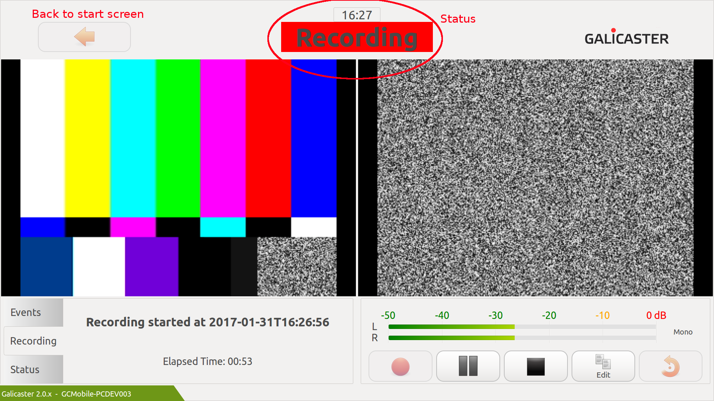
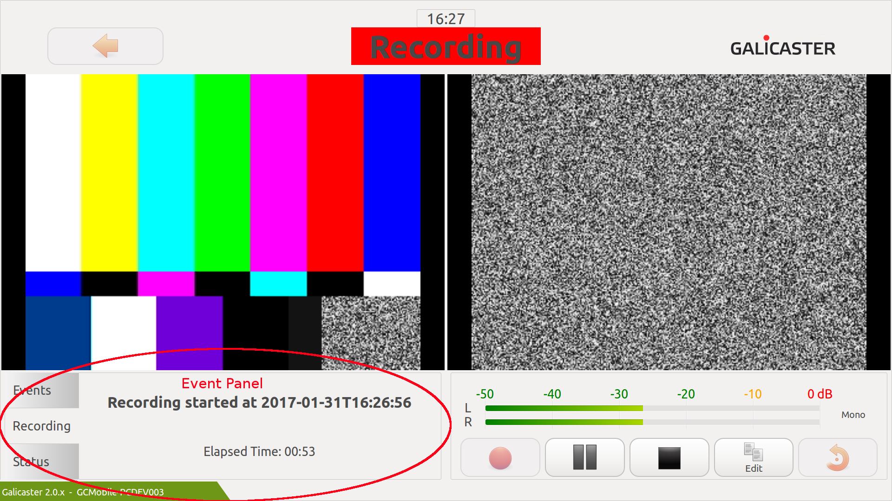
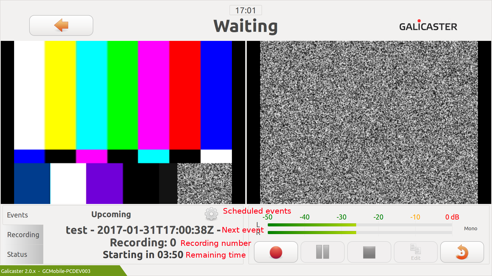
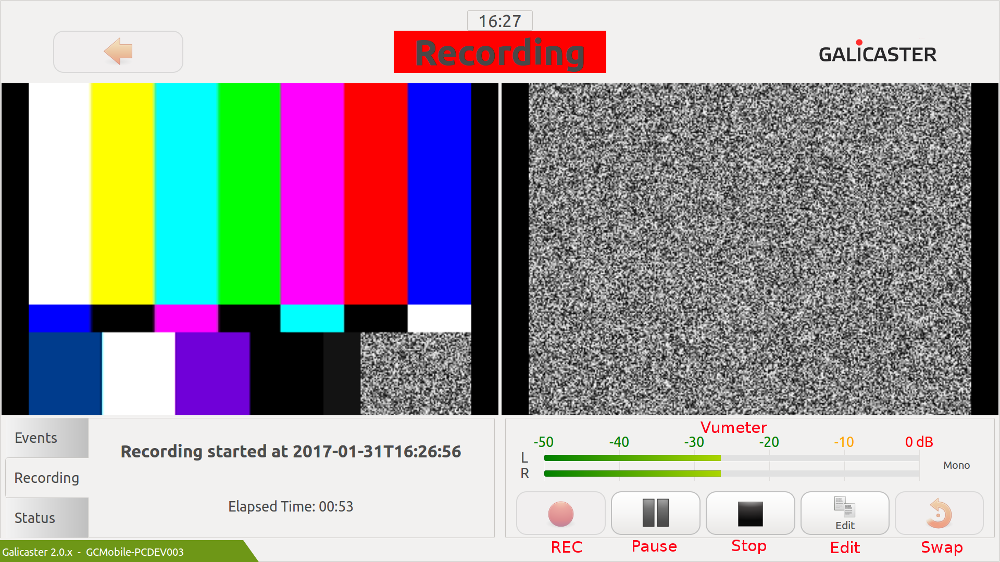

User Guide - Recorder
=====================

*This page is updated to the 2.0.1 release*

The main area of Galicaster is the Recorder. The Recorder will show you a real-time preview of the devices set in the configuration.

We will take a short tour through some screen captures and see the different sections.

#### Top Bar

In the top bar you will find the current Status and a button to return to the main page. The current time is also displayed, which can be very useful.

The Status Area will show you the current state of the recording, which can be Preview, Waiting, Recording and Stopped. Basically, you want to know if the program is actually recording or not. In case any error appears, the status will switch to Error.

#### Event Panel

The event panel will keep record of the upcoming recordings and provide you with some valuable information, like the recording's title or the current elapsed time. On the status tab you will get a aproximation of the remaining time and space for recording on the hard drive as well as the state of the connection and the name of the unit you're using.

On the event tab it will show the title of the next scheduled recording and the time to go before it starts. Seconds before starting, this timer will start blinking to get everybody's attention. Once started the event panel will show a countdown till the end of the recording.

If you want to know which recordings are scheduled, press the cogwheel and a pop up window will show the list of them, allowing you to start immediately any future recording.

#### Control Panel

The Control Panel is in the right bottom part of the screen. The panel contains the VU meter and the operation buttons.

Buttons will allow you to manage a manual recording, starting and stopping it at will. In administration mode, the Edit Button will replace the Help Button, which allows editting the recording metadata of the current recording.

